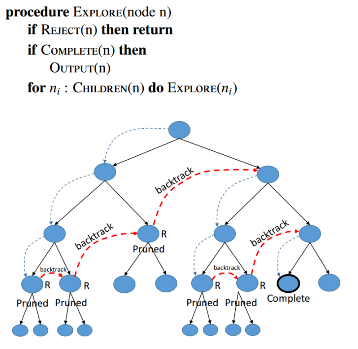

# 백트래킹(Back Tracking)

## 백트래킹이란?

**"가능한 모든 방법을 탐색한다"**

백 트래킹은 현재 상태에서 가능한 모든 후보군을 따라 들어가며 해결책에 대한 후보를 구축해 나아가다, 가능성이 없다고 판단되면 즉시 후보를 포기하면서 정답을 찾아가는 범용적인 알고리즘

**DFS의 비효율적인 경로를 차단하고 목표지점에 갈 수 있는 가능성이 있는 루트를 검사하는 방법**

### 제약 조건 만족 문제(Constraint Satisfaction Problem) 에서 해를 찾기 위한 전략

해를 찾기 위해 후보군에 제약 조건을 점진적으로 체크하다가, 해당 후보군이 제약 조건을 만족할 수 없다고 판단되는 즉시 Backtrack(다시는 이 후보군을 체크 X) 하고 바로 다른 후보군으로 넘어감

각 후보군을 DFS 방식으로 확인, 상태 공간 트리를 탐색하면서 제약이 맞지 않으면 해의 후보가 될만한 곳으로 바로 넘어감

즉 백트래킹은 트리구조를 기반으로 DFS로 깊이 탐색을 진행하면서 각 루트에 대해 조건에 부합하는지 체크(promising), 만양 해당 트리에서 조건에 맞지 않는 노드는 더이상 DFS로 깊이 탐색을 진행하지 않고 가지를 쳐버림(Purning)

***가지치기를 통해 효율을 극대화함***

