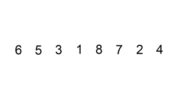
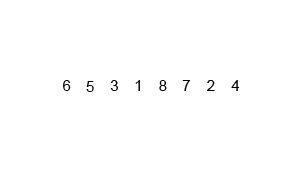

# 🔑선택 정렬 (Selection Sort)

## 🎇선택 정렬 개념

**현재 위치에 들어갈 값을 찾아 정렬하는 방법**  

현재 위치에 저장 될 값의 크기에 따라 두 개로 구분됨  

**최소 선택 정렬(Min Selection Sort)**, **최대 선택 정렬(Max Selection Sort)**  

**최소 선택 정렬은 오름차순**으로, **최대 선택 정렬은 내림 차순**으로 정렬  

## 🪧기본 로직

1. 정렬 되지 않은 인덱스의 맨 앞에서 부터, 이를 포함한 그 이후의 배열값 중 **가장 작은 값**을 찾아감  
   (정렬되지 않은 인덱스의 맨 앞은 초기 입력에선 배열의 시작위치)  

2. 가장 작은 값을 찾으면, 그 값을 **현재 인덱스의 값과 바꿔줌**  

3. 다음 인덱스에서 위의 과정을 반복  

전체 비교를 진행하므로 **시간복잡도**는 **O(n^2)**, 단 하나의 배열에서만 진행하므로 **공간복잡도**는 **O(n)**  

  

# 🔑삽입 정렬(Insertion Sort)

## 🎇삽입 정렬 개념

**현재 위치에서, 그 이하의 배열들을 비교하여 자신이 들어갈 위치를 찾아 그 위치에 삽입하여 정렬하는 방법**  

## 🪧기본 로직

1. 삽입정렬은 두 번째 인덱스부터 시작함,  
   현재 인덱스는 별도의 변수에 저장해주고, 비교 인덱스를 현재 인덱스 -1로 잡는다  

2. 별도로 저장해 둔 삽입을 위한 변수와 비교인덱스의 배열값을 비교  

3. 삽입 변수의 값이 더 작으면 현재 인덱스로 비교 인덱스의 값을 저장해주고, 비교 인덱스를 -1하여 비교를 반복  

4. 만약 삽입 변수가 더 크면 비교 인덱스+1에 삽입 변수를 저장

최악의 경우엔 **시간복잡도**는 **O(n^2)**, 이미 정렬되어 있는 경우에는 **O(n)**  

하지만 상한을 기준으로 하는 **Big O notation**은 최악의 경우를 기분으로 평가하므로, **시간 복잡도**는 **O(n^2)**  

공간 복잡도는 단 하나의 배열에서만 진행하므로 **O(n)**  

  

# 🔑버블 정렬(Bubble Sort)

## 🎇버블 정렬 개념

**매번 연속된 두 개의 인덱스를 비교하여, 정한 기준의 값을 뒤로 넘겨 정렬하는 방법**

오름차순으로 정렬하고자 할 경우 비교시 마다 큰 값이 뒤로 이동하여 한바퀴 돌 땐 가장 큰 값이 맨 뒤에 저장됨  
맨 마지막에는 비교하는 수들 중 가장 큰 값이 저장되기 때문에 (전체 배열의 크기 - 현재까지 순환한 바퀴 수)만큼만 반복하면 됨  

## 🪧기본 로직

1. 첫 번째와 두 번째 인덱스부터 시작, 현재 인덱스 값과, 바로 이전의 인덱스 값을 비교
2. 이전 인덱스가 더 크면 현재 인덱스와 바꿈  
3. 현재 인덱스가 더 크면 교환하지 않고 다음 두 연속된 배열 값을 비교함  
4. 이를 **(전체 배열의 크기 - 현재까지 순환한 바퀴 수)** 만큼 반복  

1부터 비교를 시작하여 n-1개, n-2개, ... 1개씩 비교를 반복함  

선택 정렬과 같이 배열이 어떻게 되어있던지 간에 전체 비교를 진행하므로 **시간 복잡도**는 **O(n^2)**  

공간 복잡도는 단 하나의 배열에서만 진행하므로 **O(n)**  

  

# 🔑합병 정렬(Merge Sort)

## 🎇합병 정렬 개념

**분할 정복(Divide and Conquer) 방식으로 설계된 알고리즘**

분할정복은 큰 문제를 반으로 쪼개 문제를 해결해 나가는 방식이며, 분할은 배열의 크기가 1보다 작거나 같을 때 까지 반복

입력으로 하나의 배열을 받고, 연산 중에 두개의 배열로 계속 쪼개나간 뒤 합치면서 정렬해 마지막에 하나의 정렬을 출력한다

합병은 두 개의 배열을 비교하여, 기준에 맞는 값을 다른 배열에 저장해 나감

오름차순의 경우 배열 A,배열 B를 비교하여 A에 있는 값이 더 작다면 새 배열에 저장해주고, A인덱스를 증가시킨 후 A,B의 반복을 진행

이는 A나 B중 하나가 모든 배열값들을 새 배열에 저장할 때 까지 반복하며, 전부 다 저장하지 못한 배열의 값들은 모두 새 배열의 값에 저장

## 🪧기본 로직

### ✨분할 과정

1. 현재 배열을 반으로 쪼갬
2. 배열의 시작 위치와 종료 위치를 입력받아 둘을 더한 후 2를 나눠 그 위치를 기준으로 나눔
3. **이를 쪼갠 배열의 크기가 0이거나 1일 때 까지 반복**

### ✨합병과정

1. 두 배열 A,B의 키기를 비교, 각각 배열의 현재 인덱스는 i,j

2. i에는 A배열의 시작 인덱스를 저장, j에는 B배열의 시작 주소를 저장

3. A[i]와 B[j]를 비교, 오름차순의 경우 이 중에 작은 값을 새 배열 C에 저장 
   
   A[i]가 더 컸다면 A[i]의 값을 배열 C에 저장해주고, i의 값을 하나 증가

4. 이를 i나 j 둘 중 하나가 각자 배열의 끝에 도달할 때 까지 반복

5. C 배열을 원래의 배열에 저장

**합병 과정**은 두 배열 A,B를 정렬하기 때문에, A배열의 크기를 N1, B배열의 크기를 N2라고 할 경우 **O(N1+N2)**

배열 A와 배열 B는 하나의 배열을 나눈 배열들이기 때문에 전체 배열의 길이가 N이라고 할 경우 N = N1 + N2이므로 **O(N)**

분할 과정은 lgN만큼 일어나는데, 이 이유는 간단함. 크기가 N인 배열을 분할하면, 한번 분할하면 N/2,N/2 = 2개, 그다음 분할하면 N/4,N/4,N/4,N/4 = 4개

분할 과정은 매번 반씩 감소하므로 logN만큼 반복해야 크기가 1인 배열로 분할 할 수 있음

각 분할별로 합병을 진행하므로, 합병정렬의 시간 복잡도는 **O(NlogN)** 

사용하는 공간은 정렬을 위한 배열을 하나 더 생성하므로 **2N**개 사용, 따라서 공간 복잡도는 **O(N)**

# 🔑퀵 정렬(Quick Sort)

## 🎇퀵 정렬 개념

**분할 정복(Divide and Conquer) 방식으로 설계된 알고리즘**

Pivot Point 라고 기준이 되는 값을 하나 설정하여 이 값을 기준으로 작은값은 왼쪽, 큰 값은 오른쪽으로 옮기는 방식으로 정렬을 진행

이를 반복하여 분할된 배열의 크기가 1이 되면 배열이 모두 정렬 된 것

## 🪧기본 로직

1. Pivot Point로 잡을 배열의 값 하나를 정함(보통 맨 앞이나 맨 뒤, 혹은 전체 배열 값 중 중간값이나 랜덤 값으로 정함 )

2.  분할에 앞서 비교를 진행하기 위해 **가장 왼쪽 배열의 인덱스를 저장하는 left 변수**, **가장 오른쪽 배열의 인덱스를 저장 할 right 변수**를 생성

3.  right 부터 비교를 진행, 비교는 right가 left보다 클 때만 반복하며, 비교한 배열값이 pivot point보다 크면 right를 하나 감소시키고 비교를 반복

4. 그 다음 left부터 비교를 진행, 비교는  right가 left보다 클 때만 반복하며, 비교한 배열값이 pivot point보다 작으면 left를 하나 증가시키고 비교를 반복
