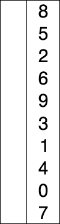

# 🔑선택 정렬 (Selection Sort)

## 🎇선택 정렬 개념
이름에 맞게 현재 위치에 들어갈 값을 찾아 정렬하는 배열  

현재 위치에 저장 될 값의 크기에 따라  
**최소 선택 정렬(Min Selection Sort)**  
**최대 선택 정렬(Max Selection Sort)**  
로 구분 할 수 있음  
**최소 선택 정렬은 오름차순**으로, **최대 선택 정렬은 내림 차순**으로 정렬  

### 🪧기본 로직
1. 정렬 되지 않은 인덱스의 맨 앞에서 부터, 이를 폼한한 그 이후의 배열값 중 가장 작은 값을 찾아감  
(정렬되지 않은 인덱스의 맨 앞은 초기 입력에선 배열의 시작위치)
2. 가장 작은 값을 찾으면, 그 값을 현재 인덱스의 값과 바꿔줌  
3. 다음 인덱스에서 위의 과정을 반복  

전체 비교를 진행하므로 시간 복잡도는 **O(n^2)**, 단 하나의 배열에서만 진행하므로 공간복잡도는 **O(n)**  

